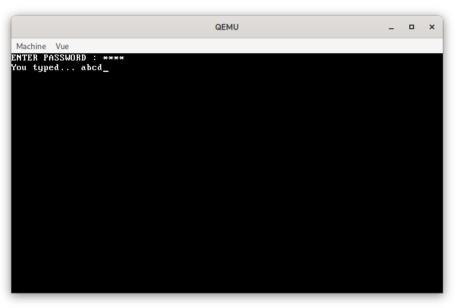

# boot2duino
boot2duino serves no other purpose than to generate a bootable x86 image using the Arduino IDE. I haven't found a suitable use for it yet, so its capabilities are currently quite limited (you can basically only print text on screen).

## Examples

```c++
Video vid;

void setup() {
  vid.print("Hello world, from Arduino!");
}

void loop() {
  
}
```


[Watch it in action!](https://vimeo.com/656339999)

```c++
Video vid;
Keyboard key;

char password[4];

void setup() {
  vid.clear();
  vid.setCursorPosition(0, 0);
  vid.print("ENTER PASSWORD : ");

  for (int i = 0; i < sizeof(password); i++) {
    password[i] = key.getch();
    vid.print('*');
  }

  char x;
  do {
    x = key.getkeycode();
  } while (x != Keyboard::kEnterKeycode);

  vid.print("\r\nYou typed... ");
  vid.print(password);
}

void loop() {
  
}
```



## How to install

Linux :

```bash
mkdir -p ~/Arduino/hardware/boot2duino
cd ~/Arduino/hardware/boot2duino
git clone https://github.com/jeanthom/boot2duino
```

Windows :

```batch
mkdir %UserProfile%\Documents\Arduino\hardware
cd %UserProfile%\Documents\Arduino\hardware
git clone https://github.com/jeanthom/boot2duino
```

## How to run

Using qemu:

```bash
qemu-system-x86_64 -drive file=boot2duino-demo.ino.x86-pc.img,index=0,if=floppy,format=raw
```
