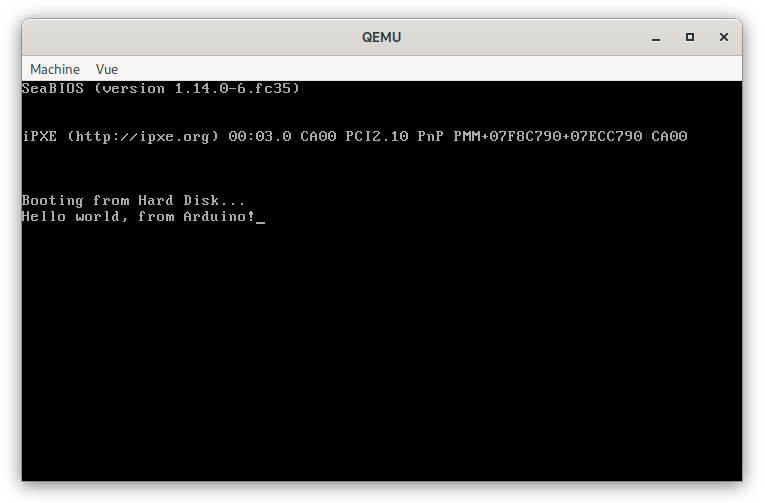

# boot2duino

boot2duino serves no other purpose than to generate a bootable x86 floppy image using the Arduino IDE, which seemingly serves no purpose.

**Watch it in action:** [writing a hello world](https://vimeo.com/656339999); [a very basic piano](https://vimeo.com/661030335).

## Examples

```c++
Video vid;

void setup() {
  vid.print("Hello world, from Arduino!");
}

void loop() {
  
}
```



Other examples:

 * [keyboard interaction](examples/keyboard.ino)
 * [piano](examples/piano.ino)

## How to install

Linux :

```bash
mkdir -p ~/Arduino/hardware/boot2duino
cd ~/Arduino/hardware/boot2duino
git clone https://github.com/jeanthom/boot2duino
```

Windows :

```batch
mkdir %UserProfile%\Documents\Arduino\hardware
cd %UserProfile%\Documents\Arduino\hardware
git clone https://github.com/jeanthom/boot2duino
```

## How to run

Using qemu:

```bash
qemu-system-x86_64 -drive file=boot2duino-demo.ino.x86-pc.img,index=0,if=floppy,format=raw -soundhw pcspk
```

## Troubleshooting

1. Install an x86 compiler
2. Try upgrading your Arduino IDE
3. Windows is not very well supported, give Linux a try
4. Upgrade GCC to 11 ([see this issue](https://github.com/jeanthom/boot2duino/issues/6))
